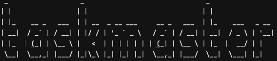

# Duke
A cli-chatbot task manager.

# Requirements

For production you will need JDK 11 support and maven for build. Source code is tested on Linux/Catalina.

# Run

Clone the repo

## Test

### With Local Github Action
```act``` test

### With Maven

```mvn test```

### Build

```mvn package``` package \
```./NoelLim/Duke.jar``` generated jar \
```java -jar ./NoelLim/Duke.jar``` run package

# Command List

`$ *`   - unknown command

`todo [description]` add ToDo \
`deadline [description] /by [date:dateOption]` add Deadline \
`event [description] /at [from:dateOption]-[to:dateOption]` add Event

- dateOption formats
    - Input year, month and day : "20201231"
    - Input year, month, day, hour, minutes : "20201231 23:59"

`delete [id]` delete task by id \
`done [id]` set task as done \
`undone [id]` set task as not done

`list` list tasks \
`find [string_in_description]` query tasks with string in description

`stats:all` summary of tasks

`projection [days]` projection for next days

`scan:duplicates` check for tasks with same description

`bye` exit input loop \
`save` save tasks to file

